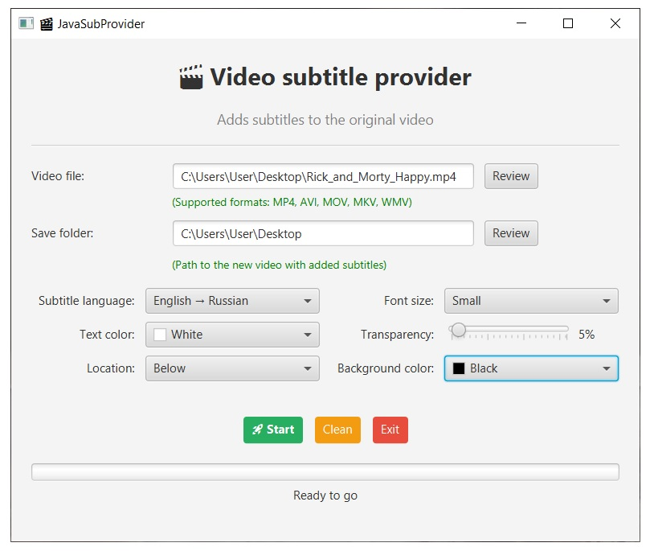
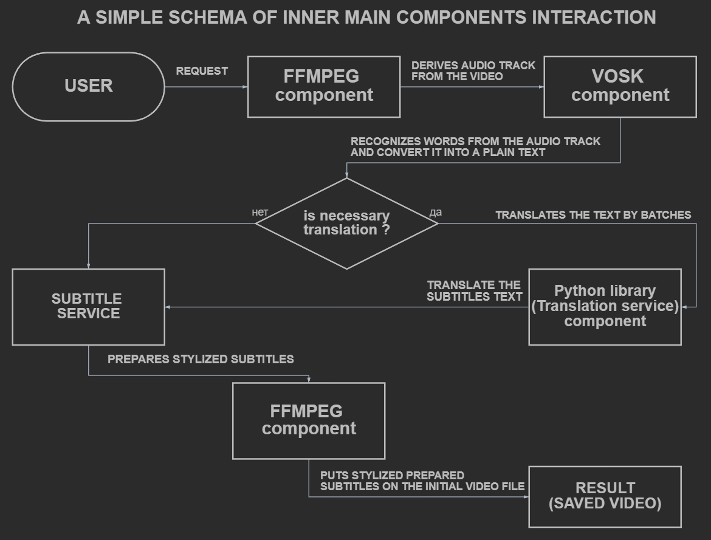

# 🎬Video Subtitle Provider
**⚠️Windows desktop app!** \
**⚠️Not for commercial use!**

The app for adding automatically generated subtitles (.ass) to video files.\
The app can provide machine translation of the original text into the selected language. \
The current 'Language selection' can be expanded ([instruction.docx](presentation_materials/instraction.docx))!

## ✨Features

- Add subtitles to video files
- Supported formats: MP4, AVI, MOV, MKV, WMV
- Customize subtitle settings:
    - Language selection (Russian/English)
    - Font size (Small/Medium/Large)
    - Text and a background color
    - Transparency of the font (0% - 80%)
    - Subtitles screen position (Top/Center/Below)
  
## 📄Graphical user interface (GUI)

## 🎥 Video subtitles demonstration:

<table align="center" style="border-collapse: collapse; border: none;">
  <tr>
    <td style="padding: 10px; text-align: center; vertical-align: top; border: none;">
      
      
<strong>English</strong>

    </td>
    <td style="width: 20px; border: none;"></td> <!-- indent -->
    <td style="padding: 10px; text-align: center; vertical-align: top; border: none;">
      
      
<strong>Russian</strong>

    </td>
  </tr>
</table>

## 🔧Schema of modules interaction

## 💻OS requirements for launching!

- Windows 10 or higher

### 🚀How to launch the app
1. download the archive with the app
2. unzip this where you need
3. launch **"JavaSubProviderApp.bat"** file inside the archive
- **Notice:** The first launch can take more time than subsequence next ones, because the app has to be compiled.

### ⚙️Stack of technology:

- Java 21
- Python 3.12.10
- Httpclient 4.5.13
- Lombok 1.18.34
- Json 20231013
- JavaFX-controls 21.0.1
- JavaFX-fxml 21.0.1
- Vosk 0.3.45
- Libretranslate 1.8.3
- FFMPEG 2025-12-07 (essential)